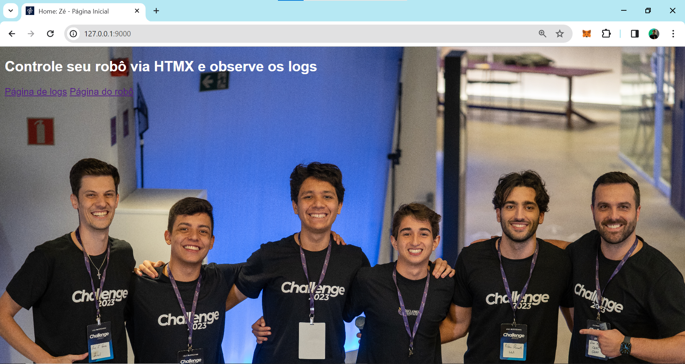
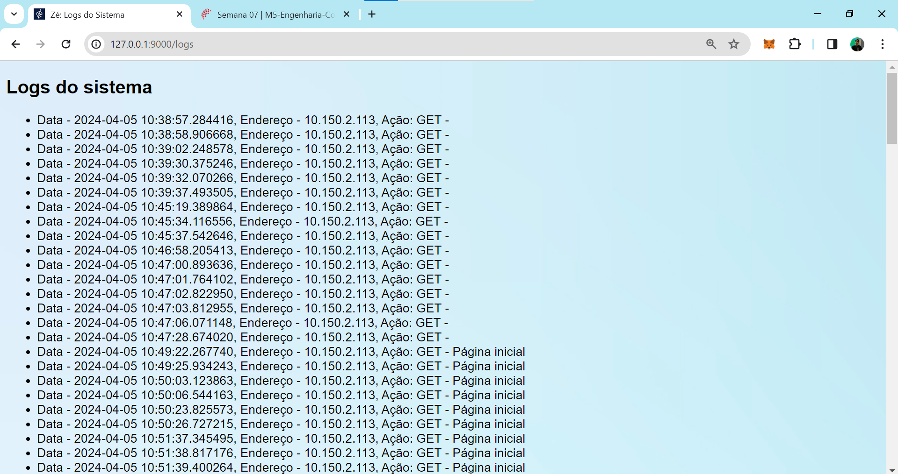
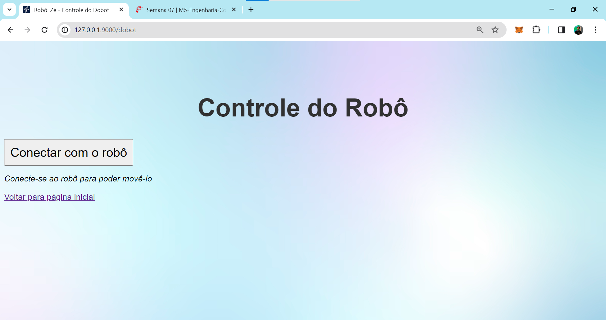

# Projeto de Movimentação do Robô Dobot Magician Lite com HTMX e Flask - José Vitor Alencar

## Descrição
Este repositório contém os arquivos e recursos necessários para a Movimentação do Robô Dobot Magician Lite com HTMX e Flask. O sistema realiza o log dos comandos enviados por uma interface gráfica construída com HTMX e servida com Flask em um servidor local. Neste servidor, o robô físico está conectado. Quando o robô não está conectado, apenas as funcionalidades de visualização do log estão disponíveis. 

## Imagens
### Página inicial

*Figura 1: Página inicial com acesso ao logs e movimentos do robô.*

### Página de logs

*Figura 2: Página de logs.*

### Página de Movimentação do Robô

*Figura 3: Página de Movimentação do Robô.*

## Estrutura do Repositório
* static/: Contém arquivos estáticos como CSS e JavaScript.
* templates/: Contém os arquivos HTML do template para renderização pelo Flask.
* app.py: O script principal da aplicação Flask.
* requirements.txt: Um arquivo de texto contendo as dependências necessárias para o projeto.

## Configuração do Ambiente

Execute os seguintes comandos para ativar o ambiente virtual e rodar a aplicação:

```bash
python3 -m venv venv
venv\Scripts\activate
pip install -r requirements.txt
python app.py
```

# Link pro vídeo
https://drive.google.com/file/d/12aGieIh9DXj9hC6h80Dq8BSH4YB2P0vy/view?usp=sharing
